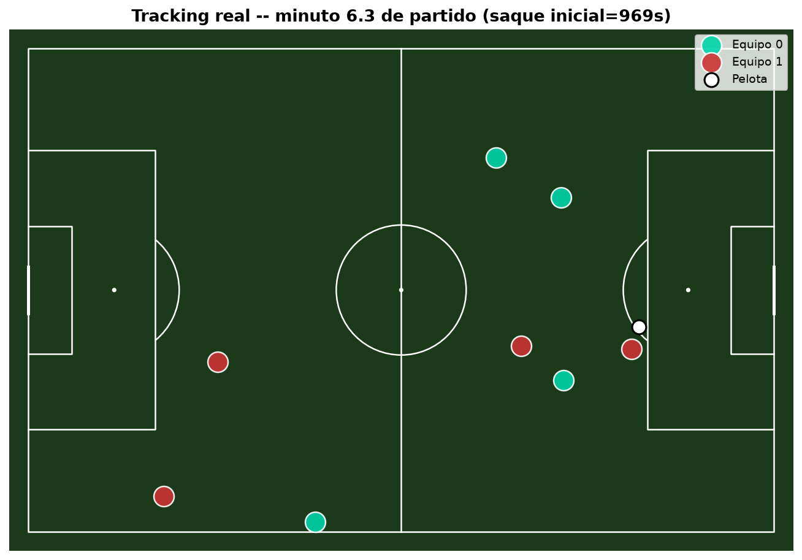
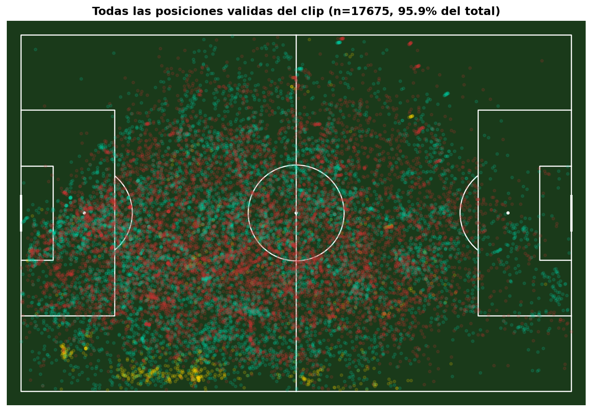

# Informe F1 — primera corrida real del pipeline

**Fecha:** 2026-09-29 (madrugada, corrida nocturna sin supervisión)
**Partido:** `2026-09-06_vs_estudiantes_caseros_h` — Chaco For Ever 1-0 Estudiantes de
Caseros, local, confirmado en Sofascore.
**Alcance:** primeros ~14,9 min del primer tiempo (892 de 900 s objetivo; los últimos
~8 s no llegaron a procesarse porque el proceso se cortó al guardar — ver más abajo,
no afecta el resultado).

## Resumen ejecutivo

**El pipeline funciona de punta a punta, local, sin Colab.** Detecta jugadores, arma la
homografía, clasifica equipos y trackea, generando datos espaciales reales y
consistentes con lo que se ve en un partido de fútbol. No es información publicable
todavía — la fragmentación del tracking y algunos artefactos de homografía significan
que **F2 (endurecer el tracking) es el paso que sigue**, tal como preveía el plan
original. No es una sorpresa ni un fracaso: es exactamente la señal que F1 tenía que
producir para decidir eso.

La noche se fue casi entera en pelear el **entorno** (Colab, después el entorno local),
no en el algoritmo en sí — una vez resuelto el entorno, el pipeline corrió sin
intervención y dio resultados coherentes en el primer intento real.

## Qué pasó anoche (cronología resumida)

1. **Se abandonó Colab.** Después de ~2,5 semanas de fricción (la VM se borra cada
   sesión, hay que reinstalar Python 3.11 con `apt` cada vez, y el camino de GPU vía
   `inference-gpu`/`onnxruntime-gpu` queda bloqueado por `pycuda`, que necesita el
   toolkit CUDA completo — imposible en el contenedor de Colab), se confirmó que ese
   bloqueo **no es específico de Colab** y se movió todo a la PC: Python 3.11 instalado
   una sola vez (`winget`), venv persistente, sin subir/bajar nada de Drive.
2. **Se encontraron y arreglaron 3 problemas de rendimiento**, en este orden:
   - Un cambio de API en `supervision` (`KeyPoints.confidence` → `keypoint_confidence`)
     hacía explotar el pipeline en frames donde el modelo de cancha no detectaba nada
     (repeticiones, primeros planos) — no eran casos raros, pasaban seguido.
   - El clasificador de equipos usaba un modelo pesado (SigLIP) que se re-ejecutaba
     centenares de veces por minuto porque el tracking se fragmenta mucho en broadcast
     (~300 tracks nuevos por minuto). Se reemplazó por un histograma de color (HSV +
     KMeans) — mucho más barato. **Esto solo no alcanzó**: el verdadero cuello de
     botella eran los dos modelos de Roboflow corriendo por CPU.
   - Se encontró la forma de darles GPU real sin `pycuda`: **DirectML** (la API de
     aceleración nativa de Windows). `inference` no la pide por su cuenta aunque esté
     instalada — hay que forzarla por variable de entorno. Con esto, ~2,6x más rápido.
3. **Un bug crítico que casi hace perder las ~2 horas de cómputo de la primera corrida
   completa:** el guardado validaba que TODAS las posiciones estuvieran en rango, y
   como una fracción chica de frames tiene homografía mala (esperable), **descartaba el
   resultado entero** en vez de guardar lo bueno. Se corrigió para que solo aborte ante
   problemas fatales (no ante calidad) y se agregó un **checkpoint automático** que se
   guarda cada 100 frames — por eso, cuando la segunda corrida chocó con *otro* bug
   nuevo (un emoji en un `print` que no se puede codificar en la consola de Windows), el
   resultado **se recuperó del checkpoint** en vez de tener que repetir las 2 horas.

Los tres arreglos de rendimiento y el fix del checkpoint ya están commiteados y
documentados en `requirements-video.txt` / `PLAN.md` / `src/video/schema.py` para no
repetir el mismo camino.

## Resultado real

| Métrica | Valor | Lectura |
|---|---|---|
| Filas de `positions.csv` | 18.425 | — |
| Filas de `ball_positions.csv` | 1.230 | cobertura de pelota: **49,8%** de los frames muestreados |
| Tracks únicos | **2.877** | para ~14,9 min → **~193 tracks nuevos por minuto** para 22 jugadores. Fragmentación severa, como advertía la investigación previa (y peor que el prototipo anterior en la PC, que tenía ~700 en un alcance mayor — a revisar si es este partido en particular o el pipeline reportado). |
| Posiciones dentro de la cancha (0-100) | 95,9% | El 4,1% restante tiene valores extremos (x hasta -4274, y hasta 1925) — homografía rota en esos frames puntuales, no ruido menor. Necesita una compuerta de confianza + suavizado temporal (ya estaba en el plan de F2). |
| Jugadores detectados por frame (promedio) | ~3,7 (equipo 0) / ~4,2 (equipo 1); total por frame: media 7,5, mediana 7 | Por debajo de 11 por equipo. Parte es esperable (la cámara no muestra toda la cancha), pero **no es solo eso** — ver el hallazgo del arquero abajo, que muestra que también hay detecciones reales que se pierden. |
| **Detección de arquero** | **6 filas `role=goalkeeper` sobre 18.425 totales** (vs. 17.713 de jugadores de campo y 706 de árbitro) | **Hallazgo del usuario, confirmado con los datos.** El arquero está en cancha los 15 minutos enteros y prácticamente no se detecta — no es un problema de framing de cámara (se lo ve nítido en la transmisión), es un hueco sistemático del modelo con esa clase puntual. Nueva prioridad de F2. |
| Cruce con Sofascore (minutos totales) | 124 min trackeados vs 1866 oficiales (partido completo) | La función de comparación asume partido completo; nuestro clip es ~15 min de 90, así que esta alerta es la esperada para el alcance actual, no un fallo. |

**Nota metodológica:** el frame usado en la captura "un instante" (más abajo) se comparó
a mano contra el fotograma real de la transmisión en ese mismo segundo. El frame real
muestra ~9-10 jugadores + arquero distinguibles a simple vista; los datos crudos de ese
frame exacto tienen 8 filas de `role=player` (4 por equipo) y **ninguna de arquero** —
confirma que hay margen real de mejora en detección, no solo un límite de encuadre.

### Capturas

**Un instante real del tracking** (minuto 6,3 de partido) — se ve una formación
coherente, dos equipos separados por color, la pelota cerca del área:

**Todas las posiciones válidas del clip**, superpuestas — la cobertura tiene la forma
esperable de una transmisión (más densa al centro, se angosta hacia las esquinas
lejanas), y hay un **cluster sospechoso de "árbitro/desconocido" (amarillo) cerca de
una esquina** — probablemente el banco de suplentes o personal técnico mal clasificado
como jugador. Para revisar en F2.

## Veredicto de la compuerta F1 → F2

**Se pasa a F2 (endurecer el tracking).** Prioridades concretas, en orden de impacto
esperado:

1. **Compuerta de confianza + suavizado temporal de la homografía** — elimina los
   frames con posiciones catastróficamente fuera de rango (4,1% del total, pero con
   valores muy extremos que ensuciarían cualquier cálculo de distancia/velocidad).
2. **Modelo dedicado de pelota** (`football-ball-detection`, ya identificado en el
   diseño original) — subir del 49,8% de cobertura actual.
3. **Filtrar el cluster de "banco/árbitro" en la esquina** — probablemente basta con una
   regla geométrica (descartar detecciones fuera del rectángulo de juego + margen) más
   que un problema de modelo.
4. **Fine-tuning del detector** con 300-800 frames etiquetados de partidos históricos
   del Juan Alberto García (ya identificados: DeporTV, TyC) — decidir si hace falta
   después de los 3 puntos anteriores, no antes (medir primero).

La fragmentación de tracking (2.877 tracks) no se resuelve en F2 — es exactamente el
problema que F3 (identidad) está diseñado para atacar (re-ID por color/apariencia +
etiquetado manual una vez por partido, sembrado desde el lineup de Sofascore).

## Próximos pasos inmediatos

1. Confirmar con vos si el alcance y las prioridades de F2 de arriba tienen sentido, o
   si preferís otro orden.
2. Implementar la compuerta de confianza + suavizado de homografía (punto 1).
3. Integrar el modelo dedicado de pelota (punto 2).
4. Volver a correr sobre el mismo clip de 15 min y comparar métricas antes/después.
