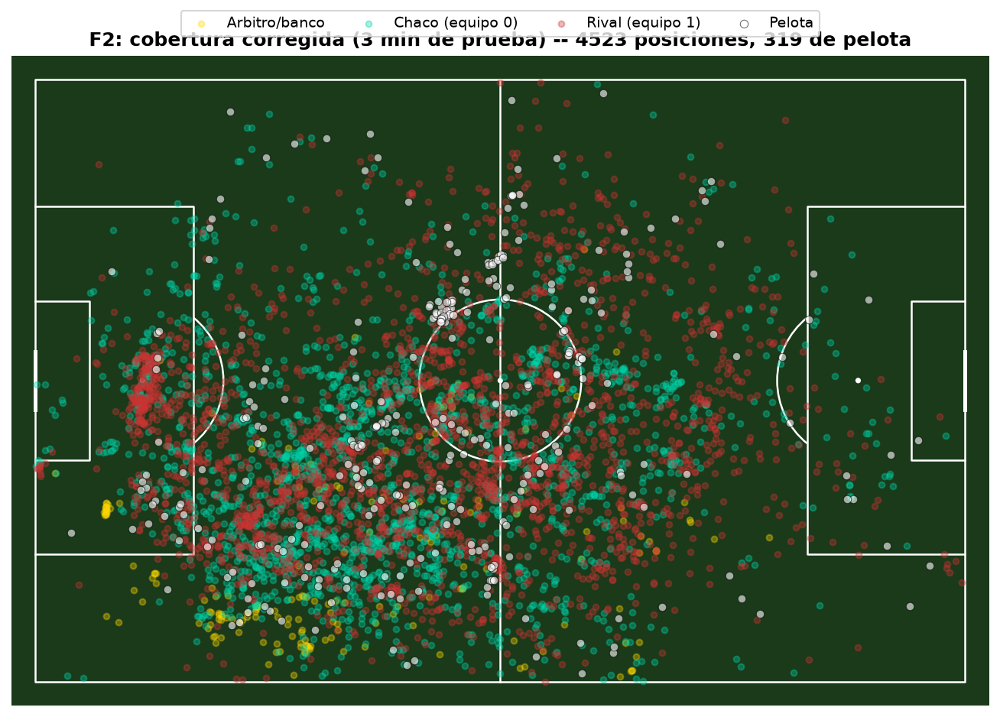

# Informe F2 (en curso) — endurecer el tracking

**Fecha:** 2026-09-29. Todas las pruebas corridas sobre los mismos **primeros 3 minutos**
del partido de F1 (`2026-09-06_vs_estudiantes_caseros_h`), para poder comparar antes/después
de forma directa.

## Resumen de lo hecho hasta ahora

| # | Ítem | Estado |
|---|---|---|
| 1 | Detección de arquero | Diagnosticado: el modelo lo detecta pero lo clasifica como `player`, no `goalkeeper`. Se difiere a F3 (identidad por posición, no por esta etiqueta). |
| 2 | Homografía con outliers | **Arreglado y verificado.** |
| 3 | Modelo dedicado de pelota | **Integrado y verificado.** |
| 4 | Cluster de banco/árbitro | Diagnosticado y cuantificado. Se difiere a F3/F4 a propósito (no se resuelve bien con geometría fija). |
| 5 | Fine-tuning | Pendiente — evaluar recién con el resultado consolidado de F2. |

## Ítem 2 — Compuerta de confianza de la homografía

**Primer intento (RANSAC + exigir más keypoints) no alcanzó** — verificado y descartado
con datos reales antes de darlo por bueno. El diagnóstico correcto: unos pocos keypoints
"consistentes entre sí" pero agrupados en una zona chica de la imagen (ej. cerca de un
arco) igual producen una homografía que extrapola mal para jugadores lejos de esa zona.

**Lo que sí funcionó:** validar el *resultado* de la transformación, no la geometría de
entrada. Si menos del 70% de la gente detectada en el frame no cae cerca de la cancha
(±15 unidades OPTA de margen), se descarta el frame entero.

| Métrica (mismos 3 min) | Antes | Después |
|---|---|---|
| Rango de x | -118,9 a 344,8 | **-10,9 a 112,1** |
| Rango de y | -262,7 a 751,5 | **-14,5 a 114,0** |
| % dentro de cancha | 96,2% | 98,0% |
| Jugadores/frame (equipo 0/1) | 4,2 / 4,4 | 4,1 / 4,5 (sin pérdida real) |
| Cobertura de pelota | 53,9% | 54,1% (sin pérdida) |
| Filas totales | 5.298 | 4.613 (-13%, esperado: se pierde el frame dudoso entero, no se inventan datos) |

Sin efectos secundarios detectados — no bajó la cobertura de jugadores ni de pelota.

## Ítem 3 — Modelo dedicado de pelota

Probado primero **en un frame real específico** donde el modelo general no encontraba la
pelota (motion blur, jugador a punto de pisarla) — el modelo dedicado sí la encontró, y
se verificó visualmente contra el frame real antes de integrarlo al pipeline.

Integrado como **respaldo**: solo corre cuando el modelo general no encuentra nada, para
no duplicar costo en los frames donde ya funciona.

| Métrica (mismos 3 min) | Antes | Después |
|---|---|---|
| Cobertura de pelota | 54,1% | **58,4%** (+4,3 puntos) |
| Tiempo de proceso | 807s | 923s (+14%, esperado por el modelo extra) |
| Confianza de las detecciones nuevas | — | 0,59 promedio (vs 0,50 de las que ya había — **no es ruido**) |

## Captura — cobertura corregida (con homografía + pelota arregladas)

Se ve: la pelota (puntos blancos) sigue el juego de forma coherente (cluster cerca del
círculo central, lógico en los primeros minutos), y **se confirma visualmente el cluster
del banco** (amarillo, abajo a la izquierda) — consistente con lo diagnosticado, sigue
ahí a propósito hasta F3/F4.

## Qué falta de F2

- Correr el clip completo de 15 minutos con todos los fixes de hoy, para tener un F1
  limpio y consolidado (no solo los 3 minutos de prueba).
- Decidir si hace falta fine-tuning (ítem 5) con el resultado consolidado en la mano.
