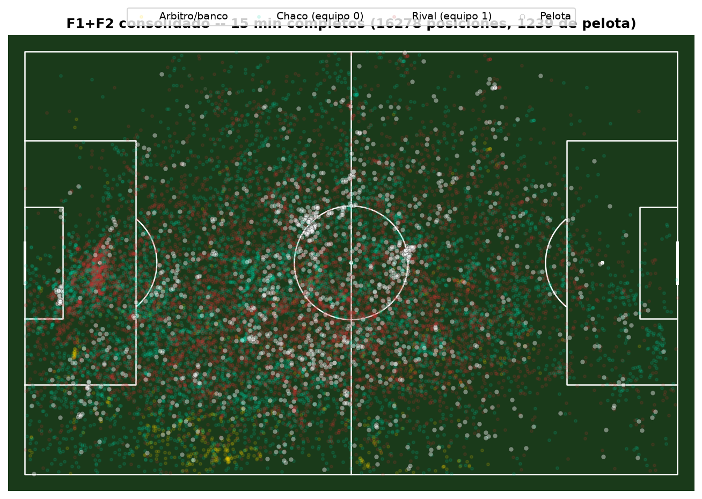

# Informe F2 (en curso) — endurecer el tracking

**Fecha:** 2026-09-29. Todas las pruebas corridas sobre los mismos **primeros 3 minutos**
del partido de F1 (`2026-09-06_vs_estudiantes_caseros_h`), para poder comparar antes/después
de forma directa.

## Resumen de lo hecho hasta ahora

| # | Ítem | Estado |
|---|---|---|
| 1 | Detección de arquero | Diagnosticado: el modelo lo detecta pero lo clasifica como `player`, no `goalkeeper`. Se difiere a F3 (identidad por posición, no por esta etiqueta). |
| 2 | Homografía con outliers | **Arreglado y verificado.** |
| 3 | Modelo dedicado de pelota | **Integrado y verificado.** |
| 4 | Cluster de banco/árbitro | Diagnosticado y cuantificado. Se difiere a F3/F4 a propósito (no se resuelve bien con geometría fija). |
| 5 | Fine-tuning | Pendiente — evaluar recién con el resultado consolidado de F2. |

## Ítem 2 — Compuerta de confianza de la homografía

**Primer intento (RANSAC + exigir más keypoints) no alcanzó** — verificado y descartado
con datos reales antes de darlo por bueno. El diagnóstico correcto: unos pocos keypoints
"consistentes entre sí" pero agrupados en una zona chica de la imagen (ej. cerca de un
arco) igual producen una homografía que extrapola mal para jugadores lejos de esa zona.

**Lo que sí funcionó:** validar el *resultado* de la transformación, no la geometría de
entrada. Si menos del 70% de la gente detectada en el frame no cae cerca de la cancha
(±15 unidades OPTA de margen), se descarta el frame entero.

| Métrica (mismos 3 min) | Antes | Después |
|---|---|---|
| Rango de x | -118,9 a 344,8 | **-10,9 a 112,1** |
| Rango de y | -262,7 a 751,5 | **-14,5 a 114,0** |
| % dentro de cancha | 96,2% | 98,0% |
| Jugadores/frame (equipo 0/1) | 4,2 / 4,4 | 4,1 / 4,5 (sin pérdida real) |
| Cobertura de pelota | 53,9% | 54,1% (sin pérdida) |
| Filas totales | 5.298 | 4.613 (-13%, esperado: se pierde el frame dudoso entero, no se inventan datos) |

Sin efectos secundarios detectados — no bajó la cobertura de jugadores ni de pelota.

## Ítem 3 — Modelo dedicado de pelota

Probado primero **en un frame real específico** donde el modelo general no encontraba la
pelota (motion blur, jugador a punto de pisarla) — el modelo dedicado sí la encontró, y
se verificó visualmente contra el frame real antes de integrarlo al pipeline.

Integrado como **respaldo**: solo corre cuando el modelo general no encuentra nada, para
no duplicar costo en los frames donde ya funciona.

| Métrica (mismos 3 min) | Antes | Después |
|---|---|---|
| Cobertura de pelota | 54,1% | **58,4%** (+4,3 puntos) |
| Tiempo de proceso | 807s | 923s (+14%, esperado por el modelo extra) |
| Confianza de las detecciones nuevas | — | 0,59 promedio (vs 0,50 de las que ya había — **no es ruido**) |

## Captura — cobertura corregida (con homografía + pelota arregladas)

Se ve: la pelota (puntos blancos) sigue el juego de forma coherente (cluster cerca del
círculo central, lógico en los primeros minutos), y **se confirma visualmente el cluster
del banco** (amarillo, abajo a la izquierda) — consistente con lo diagnosticado, sigue
ahí a propósito hasta F3/F4.

## Consolidado — mismos fixes sobre los 15 minutos completos (no solo la muestra)

Corrido dos veces (la primera se cortó por falta de memoria del sistema a los 539/900s
—no es un bug del código—, checkpoint intacto, se liberó memoria y se relanzó desde
cero). Terminó en **75,8 minutos** (mejor que la estimación de ~2,3h).

| Métrica | F1 original (2026-09-29 madrugada) | F1 + fixes de F2 (mismo día, más tarde) |
|---|---|---|
| Rango de x | -4274,3 a 803,9 | **-15,0 a 114,9** |
| Rango de y | -2821,2 a 1925,4 | **-14,6 a 114,7** |
| % dentro de cancha | 95,9% | 96,8% |
| Cobertura de pelota | 49,8% | **56,9%** (+7,1 puntos) |
| Tracks únicos | 2.877 | 2.733 |
| Filas de posiciones | 18.425 | 16.820 |

Los fixes se sostienen en el clip completo, no solo en la muestra de 3 minutos usada
para desarrollarlos — la mejora de pelota fue incluso mayor (+7,1 puntos vs +4,3 en la
muestra).

Se ve la pelota (blanco) siguiendo el juego con dos concentraciones cerca del círculo
central (reinicios), y sigue presente el cluster del banco (amarillo, abajo a la
izquierda) — como corresponde, todavía sin filtrar a propósito.

## Qué falta de F2

- ~~Correr el clip completo de 15 minutos con todos los fixes de hoy~~ ✅ hecho, ver
  consolidado arriba.
- **Decidir si hace falta fine-tuning (ítem 5)** con el resultado consolidado en la
  mano. La fragmentación de tracking (2.733 tracks para ~22 jugadores en 15 min) sigue
  siendo el número más llamativo, pero es el problema que F3 (identidad) está diseñado
  para atacar, no algo que el fine-tuning del detector resuelva por sí solo — probable
  que convenga pasar directo a F3 y volver a fine-tuning más adelante si hace falta.
